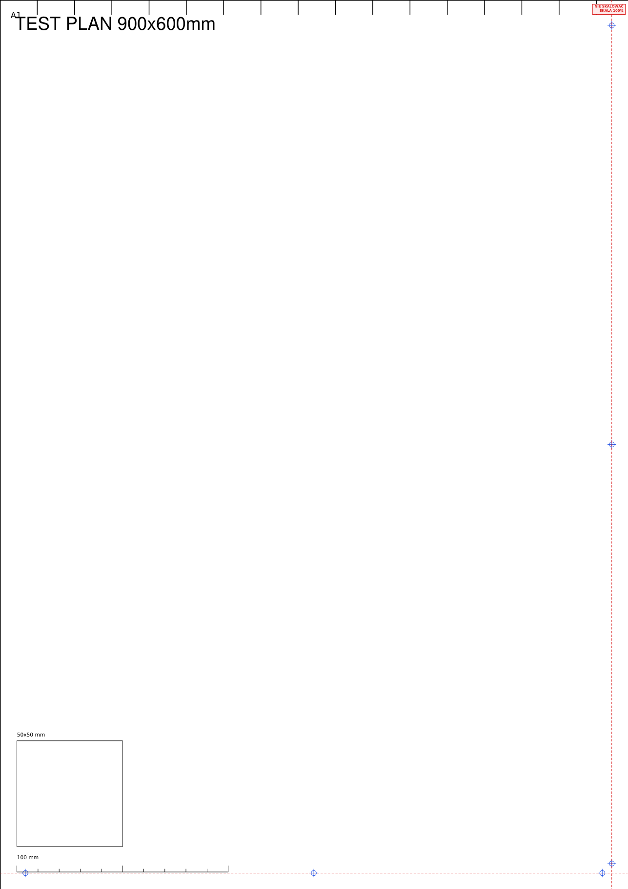

<p align="center">
  <a href="README.pl.md">Polski</a> · <b>English</b>
</p>

<p align="center">
  
</p>

<h1 align="center">GhostPoster</h1>
<p align="center"><b>Professional PDF Tiling & Poster Generator</b></p>
<p align="center">
  Split large PDF plans into smaller sheets (A4, A3, A2…) and print them on
  a regular printer at 1:1 scale, with a shared overlap tab for gluing.
</p>
<h2 align="center">PDF in. Plan out.</h2>


<p align="center">
  <a href="https://github.com/nftomczain/GhostPoster/actions"></a>
  
  
 
</p>

---

## Screenshots

| Program window (GUI) | Generated PDF |
|---|---|
|  |  |

Left: live preview with the tile grid overlaid (here with auto-detect
content enabled — the program found the actual drawing area on its own
and skipped the blank margins). Right: one of the generated sheets — you
can see registration marks (blue), cut lines (red dashed), sheet
numbering, a 100 mm reference ruler, and a 50×50 mm calibration square.

---

## Features

| Feature | Description |
|---|---|
| **Splitting into sheets** | ISO A0–A6, Letter/Legal/Tabloid, ANSI A–E, ARCH A–E1 — 0–50 mm overlap, always 100% scale (no rescaling) |
| **Auto-orientation (`--maximize`)** | Picks portrait/landscape for the chosen format on its own to minimize the number of sheets |
| **Auto-detect content** | Detects the actual drawing area and skips blank page margins before splitting |
| **Select content area manually** | When auto-detect gets it wrong — drag the corners on the preview (like in CAD) or type coordinates, `--crop-rect` in the CLI |
| **Blank-sheet detection** | Warns about, or automatically skips, sheets that would come out essentially blank — saves paper |
| **Registration marks** | Registration crosses, cut lines, sheet numbering (A1, B2…), a 100 mm ruler, a 50×50 mm calibration square |
| **Print Shop mode** | A "do not scale" stamp placed in the overlap area + a print job info sheet at the start of the file |
| **Live preview (GUI)** | The tile grid updates instantly as you change the paper size, overlap, or any option; mouse-wheel zoom up to 200% |
| **PDF metadata** | Title/Creator/Producer set on every generated file |
| **Polish diacritics** | Correct rendering of ą ć ę ł ń ó ś ź ż (bundled DejaVu Sans font) |
| **Cross-platform** | Linux, Windows, macOS — CI checks all three on every push |

## Installation

```bash
git clone https://github.com/nftomczain/GhostPoster.git
cd GhostPoster
pip install -e .          # CLI only
pip install -e ".[gui]"   # CLI + GUI (PySide6)
```

## Quick start

```bash
ghostposter plan.pdf --paper A3 --overlap 15 --maximize --auto-crop --output plan_A3.pdf
```

That's enough to get going: the program picks the sheet orientation on its
own, trims blank margins, and saves print-ready A3 sheets with a 15 mm
overlap.

## GUI

```bash
ghostposter-gui
```

Drop a PDF (or choose a file with the button/Enter), set the paper size
and overlap, check the options you need, export. The preview with the
overlaid grid updates live — including after turning on auto-detect
content, changing its margin, or toggling blank-sheet skipping — and the
export shows a real progress bar.

If auto-detect struggles with an unusual PDF (e.g. a thin frame line
reaching the very edge of the page), the "Select content area..." button
lets you mark it manually: drag the corners right on the preview (like in
CAD — double-click confirms the selection), or type exact X0/Y0/X1/Y1
coordinates in millimeters — fully keyboard-accessible. The starting
rectangle automatically matches the detected content when possible,
instead of the whole page, and the selection size is shown live while
dragging. "Back to auto-detect" undoes the manual selection.

The interface is bilingual (PL/EN, switcher in the top-right corner of the
window). The last-used language, paper size, overlap, content-detection
margin, and every checkbox (`--maximize`, `--auto-crop`, skipping blank
sheets, Print Shop mode) are remembered between runs.

A short splash screen appears on launch, and a "❓ Help" menu in the
top-right corner links to the documentation, a quick guide, GitHub, bug
reporting (including a real `GHOSTPOSTER_DEBUG=1` diagnostics mode), and
an About dialog.

Designed for one-handed use — every action is also available from the
keyboard (`Ctrl+O` opens a file, `Ctrl+E` exports) — and for screen
readers (every control has an `accessibleName` set). On smaller screens
the whole window content scrolls, so every control stays reachable even
when the window doesn't fully fit vertically.

## CLI

```bash
ghostposter plan.pdf --paper A3 --overlap 15 --marks --cutlines --labels --output plan_A3.pdf
```

| Option | Description | Default |
|---|---|---|
| `--paper` | Target sheet format: A0–A6, Letter, Legal, Tabloid, ANSI-A–E, ARCH-A–E1 | `A4` |
| `--overlap` | Overlap width in mm (0–50) | `10` |
| `--page` | Source PDF page number (0-based) | `0` |
| `--output` | Output file path | `<name>_tiled.pdf` |
| `--maximize` | Auto-orientation — fewer sheets, always 100% scale | off |
| `--auto-crop` | Trim to the actual drawing area before splitting | off |
| `--crop-margin` | Margin (mm) kept around detected content with `--auto-crop`: 0/2/5/10/20 | `5` |
| `--skip-blank` | Skip automatically detected blank sheets (no prompt) | off |
| `--keep-blank` | Keep the full grid even if some sheets come out blank | off |
| `--blank-threshold` | Blank-sheet detection threshold in % ink — raise it if a thin frame line keeps near-empty tiles from being recognized as blank | `0.5` |
| `--crop-rect` | Manually defined content area `'x0,y0,x1,y1'` in mm — skips auto-detection, useful when it struggles | none (auto) |
| `--letter-per-row` | Sheet numbering as letter=row, number=column (A1, A2, B1, B2...) instead of the default letter=column, number=row (A1, B1, A2, B2...) | off |
| `--marks` | Registration crosses on shared overlaps | off |
| `--cutlines` | Cut lines on shared overlaps | off |
| `--labels` | Sheet numbering + 100 mm ruler + 50×50 mm square | off |
| `--print-shop` | Print Shop mode: "do not scale" stamp + print job info sheet | off |

Without any blank-sheet flag: if the program detects blank sheets, it asks
whether to skip them when run in an interactive terminal; in a script
(e.g. CI) it just keeps them and suggests using `--skip-blank`.

Run without installing: `python -m ghostposter ...`

## Examples

`examples/` contains synthetic test files (generated by
`scripts/generate_examples.py`) covering different cases:

| File | Case |
|---|---|
| `plan_A0_poster.pdf` | A single page in A0 format |
| `plan_large_margins.pdf` | Content only in the center block — a good test for `--auto-crop` |
| `plan_multipage.pdf` | 3 pages of different sizes — tests `--page` |
| `plan_wide_strip.pdf` | A very wide, short plan — a good test for `--maximize` |

```bash
ghostposter examples/plan_large_margins.pdf --paper A4 --auto-crop --output out.pdf
```

## Portable Linux version (AppImage)

One file, no installation, no `pip install`:

1. [GitHub Actions](https://github.com/nftomczain/GhostPoster/actions) →
   latest successful **CI** run → **GhostPoster-x86_64-AppImage** artifact.
2. `chmod +x GhostPoster-x86_64.AppImage`
3. `./GhostPoster-x86_64.AppImage`

Build it yourself:

```bash
./scripts/build_appimage.sh
```

## Flatpak

Alongside the AppImage, GhostPoster also ships as a Flatpak
(`flatpak/io.github.nftomczain.GhostPoster.yml`), built on top of the
official [io.qt.PySide.BaseApp](https://github.com/flathub/io.qt.PySide.BaseApp)
so it doesn't need to compile Qt itself:

1. [GitHub Actions](https://github.com/nftomczain/GhostPoster/actions) →
   latest successful **CI** run → **GhostPoster.flatpak** artifact.
2. `flatpak install --user GhostPoster.flatpak`
3. `flatpak run io.github.nftomczain.GhostPoster`

Build it yourself (needs `flatpak` and `flatpak-builder`, and downloads
the KDE runtime + PySide BaseApp from Flathub on first run):

```bash
./scripts/build_flatpak.sh
```

## Windows support
Want to help?

I'm looking for contributors who can help build, test and package the native Windows version.

If you can help with any of the following, I'd really appreciate it:

- Build the project on Windows 10/11 using PyInstaller
- Test the generated executable
- Report Windows-specific issues
- Improve the Windows packaging process
- Help automate Windows releases through GitHub Actions

Repository: https://github.com/nftomczain/GhostPoster

Thank you for any contribution!

To build it yourself on Windows:

```powershell
.\scripts\build_windows.ps1
```

The result lands in `dist\GhostPoster\` — the whole folder is portable,
you can zip it up and send it to someone with no installer needed.

## CI

GitHub Actions (`.github/workflows/ci.yml`) runs on every push and PR to
`main`: `ruff check`, `black --check`, `pytest` (Linux/Windows/macOS ×
Python 3.10–3.12 matrix), a package build (`python -m build`), a portable
`GhostPoster.exe` for Windows, a portable `GhostPoster-x86_64.AppImage`
for Linux (via PyInstaller), and a `GhostPoster.flatpak` bundle (via
`flatpak-builder`, on top of `io.qt.PySide.BaseApp`).

## Release history

See GitHub Releases for the full changelog.

### v1.0.0

- First stable release
- GUI and CLI
- Automatic content detection
- Manual content selection
- Live preview
- AppImage distribution

### v2.0.0

- Flatpak packaging alongside AppImage
- Configurable sheet numbering style (`--letter-per-row`)
- Scrollable window content, keeping every control reachable even on smaller screens
- Splash screen now always displays the current version (rendered at runtime instead of baked into the image)
- The entire preview area accepts drag & drop, Enter, or click to open a PDF
- Mouse-wheel zoom on the preview (100–200%), centered on the cursor, with click-and-drag panning when zoomed in
- Clear warning when registration marks or cut lines are requested with **0 mm overlap**. Since these marks belong to the overlapping strip between sheets, no overlap means there is nothing to draw. The warning is shown in red, flashes briefly three times to attract attention, then remains visible without continuous blinking for accessibility.

## Future ideas

Not blocking 1.0.0, but worth considering:

- a macOS package (`.app`/DMG)

### macOS support

GhostPoster is designed to be cross-platform, but I currently don't have access
to macOS hardware for building and testing native releases.

If you'd like to help with packaging or testing on macOS, contributions are
very welcome.

## License

MIT — see [LICENSE](LICENSE).

---

## Availability

**A mirror that won't be forgotten.**

### Source Code
https://github.com/nftomczain/GhostPoster

### IPFS (immutable release)
https://ipfs.io/ipfs/QmeXdBgdic86xgV3mQwa5ZjFZDuCBEZFk6KDTrUBZHXLEB

### IPNS (always latest)
https://ipfs.io/ipns/k51qzi5uqu5di41zx1zd5tilwa74n3ebwwmqug800haw5qa4a6jrtnmr3k99c0

---

## Support

GhostPoster is free and open source.

If it has been useful to you and you'd like to support future development, you can do so on Liberapay.

[](https://liberapay.com/nftomczain/)

